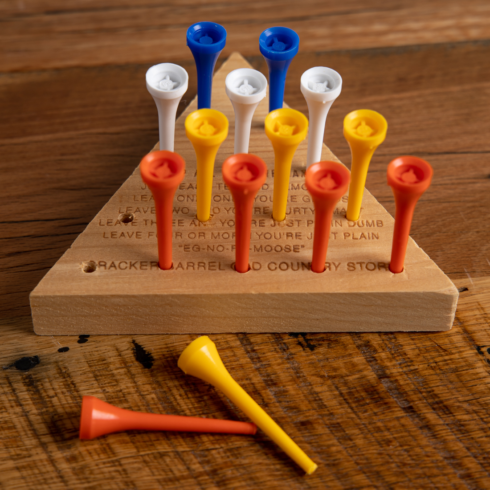
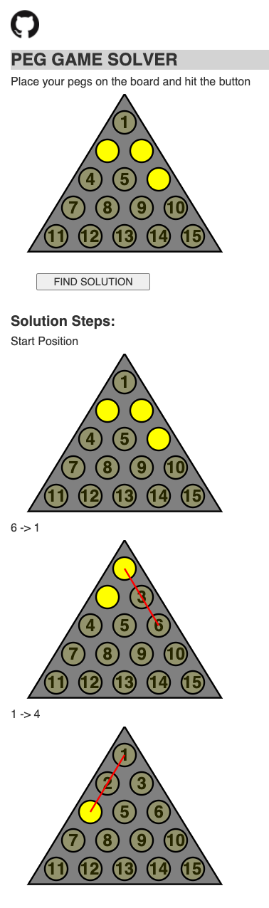

# Peg Game Solver

Solves triangle peg solitare boards.
As seen in Cracker Barrel:

## Running:

Just select what pegs you have left on the board and hit the button.

For example:

## Algorithm:

My solution is using a recursive Depth-First-Search implementation.
Board states are treated as nodes,
and all possible moves for a given state are edges to other board states.
The function returns the longest search path.
In this case the longest path will require removing the most pegs possible
(or "traveling along the most edges" in the backing tree structure).